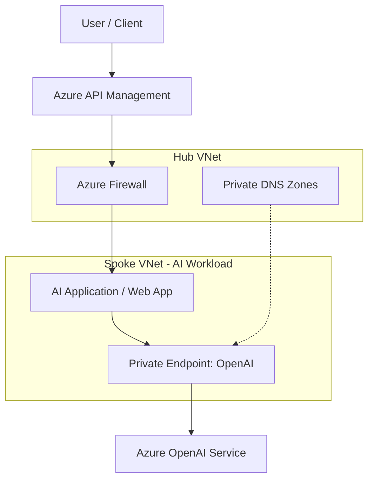

# Azure OpenAI Foundations Reference Architecture

This reference architecture illustrates the hub-and-spoke networking pattern for secure enterprise deployment of Azure OpenAI.

## Architecture Diagram (Mermaid)

## Key Considerations
- **Private Link**: All traffic to Azure OpenAI stays within the Microsoft backbone network.
- **Hub-Spoke Topology**: Centralizes security management (Firewall, DNS) in the hub.
- **Managed Identity**: Authenticates between App and OpenAI without secrets.
