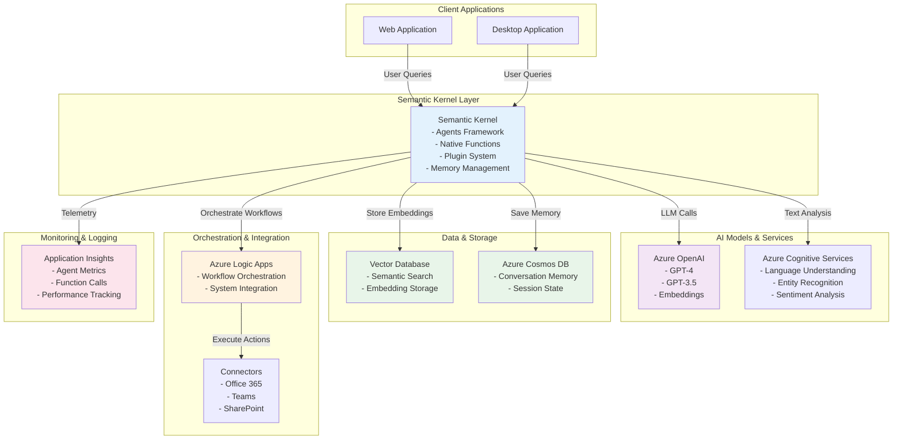

# Semantic Kernel Agent - Reference Architecture

## Overview
This diagram shows how to build intelligent agents using Microsoft Semantic Kernel framework integrated with Azure services, enabling orchestrated AI-driven workflows and autonomous task execution.

## Architecture Diagram

## Key Components

| Component | Purpose | Azure Service |
|-----------|---------|----------------|
| **Semantic Kernel** | Agent framework & orchestration | Microsoft Semantic Kernel SDK |
| **LLM Provider** | Language model capabilities | Azure OpenAI Service |
| **Cognitive Services** | NLP and text analysis | Azure Cognitive Services |
| **Vector Database** | Semantic search & embeddings | Azure AI Search or Azure Cosmos DB |
| **Memory Storage** | Agent memory & conversation history | Azure Cosmos DB |
| **Workflow Orchestration** | Complex agent workflows | Azure Logic Apps |
| **Monitoring** | Agent performance tracking | Application Insights |

## Agent Capabilities

### Core Functions
- **Planning**: Break complex tasks into subtasks
- **Reasoning**: LLM-based decision making
- **Tool Integration**: Execute native and semantic functions
- **Memory Management**: Maintain conversation context

### Plugin System
- Create reusable skill plugins
- Integrate external APIs
- Chain function calls
- Handle error recovery

## Semantic Kernel Patterns

### 1. Sequential Orchestration
Functions execute in defined order with results flowing to next function.

### 2. Parallel Execution
Multiple functions execute simultaneously for performance optimization.

### 3. Conditional Logic
LLM decides which plugins/functions to invoke based on user input.

### 4. Feedback Loops
Agent can refine outputs based on validation results.

## Security & Best Practices

- **API Key Management**: Azure Key Vault integration
- **Function Validation**: Input/output validation for all plugins
- **Rate Limiting**: Implement token budget controls
- **Audit Logging**: Track all agent decisions and actions
- **Error Handling**: Graceful degradation and retry policies

## References

- [Microsoft Semantic Kernel Documentation](https://learn.microsoft.com/en-us/semantic-kernel/)
- [Semantic Kernel GitHub Repository](https://github.com/microsoft/semantic-kernel)
- [Azure OpenAI Integration Guide](https://learn.microsoft.com/en-us/azure/ai-services/openai/)
- [Agent Design Patterns](https://learn.microsoft.com/en-us/azure/architecture/ai-ml/agent-design-patterns)
