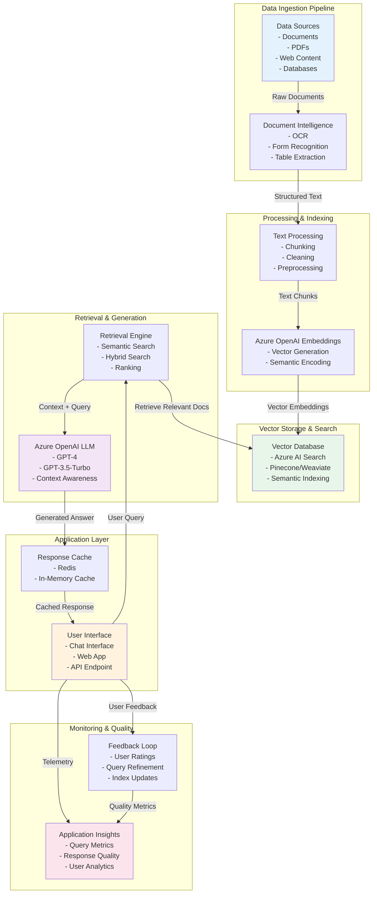

# Enterprise RAG (Retrieval Augmented Generation) - Reference Architecture

## Overview
This diagram illustrates an enterprise-grade Retrieval Augmented Generation system that combines document ingestion, semantic search, and LLM-powered question answering to build intelligent knowledge systems.

## Architecture Diagram

## Key Components

| Component | Purpose | Azure Service |
|-----------|---------|----------------|
| **Data Ingestion** | Ingest and normalize documents | Azure Document Intelligence |
| **Text Processing** | Split, clean, and prepare text | Langchain/LlamaIndex frameworks |
| **Vector Embeddings** | Convert text to vectors | Azure OpenAI Embeddings |
| **Vector Store** | Index and search vectors | Azure AI Search |
| **LLM Provider** | Generate contextual responses | Azure OpenAI Service |
| **Caching** | Cache frequent responses | Azure Cache for Redis |
| **Monitoring** | Track system performance | Application Insights |

## RAG Pipeline Stages

### 1. Indexing Stage
- **Document Ingestion**: Load documents from various sources
- **Text Processing**: Split into chunks, handle metadata
- **Embedding**: Generate vector representations
- **Storage**: Index vectors in vector database

### 2. Retrieval Stage
- **Query Embedding**: Convert user question to vector
- **Semantic Search**: Find similar documents
- **Ranking**: Score and rank results
- **Context Assembly**: Prepare context for LLM

### 3. Generation Stage
- **Prompt Construction**: Build prompt with context
- **LLM Call**: Generate answer using GPT-4
- **Post-Processing**: Format and clean response
- **Caching**: Store response for future queries

## Advanced RAG Techniques

### Hybrid Search
Combine semantic search with BM25 keyword search for comprehensive retrieval.

### Re-ranking
Use cross-encoder models to re-rank retrieved documents for relevance.

### Prompt Engineering
Optimize prompts with specific instructions and examples for better results.

### Query Expansion
Expand user queries to capture more relevant documents.

## Security & Compliance

- **Access Control**: Role-based access to documents via Entra ID
- **Encryption**: TLS for data in transit, encryption at rest
- **Audit Logging**: Track all queries and data access
- **PII Handling**: Redaction of sensitive information
- **Data Retention**: Implement purging policies

## Performance Optimization

- **Caching Strategy**: Cache embeddings and common queries
- **Batch Processing**: Process documents in parallel
- **Index Optimization**: Regular maintenance and optimization
- **Query Filtering**: Pre-filter by metadata before semantic search

## References

- [Azure AI Search Documentation](https://learn.microsoft.com/en-us/azure/search/)
- [Azure Document Intelligence](https://learn.microsoft.com/en-us/azure/ai-services/document-intelligence/)
- [RAG Best Practices](https://learn.microsoft.com/en-us/azure/architecture/ai-ml/rag-pattern)
- [Semantic Kernel RAG Pattern](https://learn.microsoft.com/en-us/semantic-kernel/)
