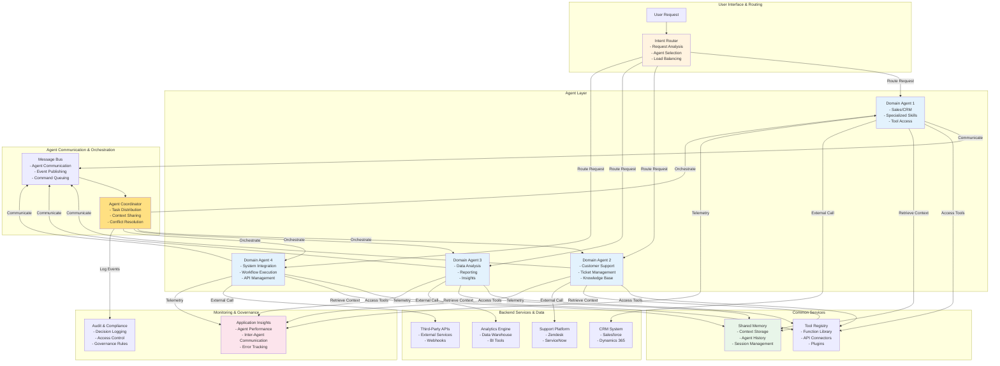

# Multi-Agent Orchestration - Reference Architecture

## Overview
This diagram shows how to orchestrate multiple specialized AI agents working together to solve complex business problems, with each agent handling specific domains and collaborating through a central coordinator.

## Architecture Diagram

## Key Components

| Component | Purpose | Technology |
|-----------|---------|-----------|
| **Intent Router** | Analyzes user requests and routes to appropriate agents | Azure Cognitive Services, NLP |
| **Domain Agents** | Specialized agents for specific business domains | Semantic Kernel, LLMs |
| **Agent Coordinator** | Orchestrates multi-agent workflows | Custom orchestration logic |
| **Message Bus** | Facilitates inter-agent communication | Azure Service Bus, Event Grid |
| **Shared Memory** | Maintains context across agents | Azure Cosmos DB, Redis |
| **Tool Registry** | Manages available functions and APIs | Function library management |
| **Audit & Compliance** | Tracks decisions and enforces governance | Application Insights, Compliance logs |

## Multi-Agent Patterns

### Sequential Workflow
Agents execute tasks in sequence, passing outputs as inputs to the next agent.

### Parallel Execution
Multiple agents work simultaneously on different aspects of a problem.

### Hierarchical Agents
Parent agents delegate tasks to specialized sub-agents and aggregate results.

### Competitive Agents
Multiple agents propose solutions; best one is selected based on quality metrics.

### Collaborative Agents
Agents negotiate and collaborate to reach consensus on complex decisions.

## Orchestration Strategies

### Centralized Orchestration
Single coordinator manages all agent interactions and task distribution.

### Decentralized Orchestration
Agents communicate directly; minimal central control for scalability.

### Hybrid Orchestration
Mix of centralized coordination for critical flows and decentralized for routine tasks.

## Advantages of Multi-Agent Architecture

- **Specialization**: Each agent expert in their domain
- **Scalability**: Add agents for new capabilities easily
- **Resilience**: Single agent failure doesn't halt entire system
- **Maintainability**: Easier to update individual agents
- **Parallel Processing**: Multiple agents work simultaneously
- **Flexibility**: Easy to recombine agents for new scenarios

## Inter-Agent Communication Patterns

### Direct Communication
Agents communicate peer-to-peer with defined contracts.

### Message-Based
Agents publish/subscribe to messages through central bus.

### Event-Driven
Agents react to events and trigger actions.

### Request-Response
Standard synchronous request-response protocol.

## Best Practices

- **Clear Responsibilities**: Define domain boundaries for each agent
- **Idempotency**: Ensure agents can safely retry failed operations
- **Timeout Handling**: Implement sensible timeouts for agent interactions
- **State Management**: Use distributed state management for context
- **Monitoring**: Track inter-agent communications and latencies
- **Versioning**: Manage agent API versions carefully
- **Error Recovery**: Implement circuit breakers and fallback strategies

## References

- [Agent-Oriented Architecture](https://learn.microsoft.com/en-us/azure/architecture/ai-ml/agent-design-patterns)
- [Orchestration Patterns](https://learn.microsoft.com/en-us/azure/architecture/patterns/)
- [Azure Service Bus for Messaging](https://learn.microsoft.com/en-us/azure/service-bus-messaging/)
- [Semantic Kernel Multi-Agent Patterns](https://learn.microsoft.com/en-us/semantic-kernel/)
