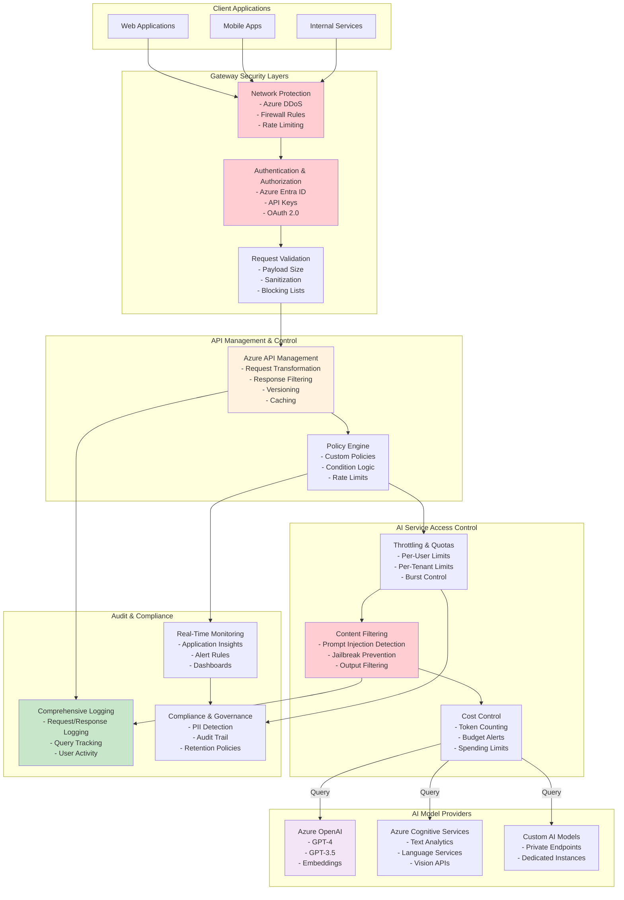

# Secure AI Gateway - Reference Architecture

## Overview
This diagram illustrates a comprehensive enterprise-grade gateway for securing, controlling, and monitoring all AI/LLM API access, implementing defense-in-depth security with multiple layers of protection.

## Architecture Diagram

## Key Components

| Component | Purpose | Azure Service |
|-----------|---------|----------------|
| **Network Protection** | DDoS mitigation, firewall rules | Azure DDoS Protection, Firewall |
| **Authentication** | Verify identity and credentials | Microsoft Entra ID, API Keys |
| **Request Validation** | Sanitize and validate inputs | Custom validation logic |
| **API Gateway** | Central API management | Azure API Management |
| **Policy Engine** | Apply custom business rules | APIM Policy Engine |
| **Content Filtering** | Detect threats and attacks | Custom ML models, Heuristics |
| **Cost Control** | Monitor and limit spending | Token counting, Budgets |
| **Compliance** | Track and enforce policies | Audit logs, Compliance reports |

## Security Features

### Defense-in-Depth
- Multiple validation layers prevent attacks at each stage
- No single point of failure
- Layered security reduces overall risk

### Authentication & Authorization
- Multi-factor authentication (MFA) support
- Role-based access control (RBAC)
- Service-to-service authentication
- API key rotation and management

### Threat Protection
- Prompt injection detection using ML models
- Jailbreak attempt detection
- SQL injection and XSS prevention
- Rate limiting per user/tenant

### Content Safety
- PII (Personally Identifiable Information) detection
- Sensitive data redaction
- Output filtering for harmful content
- Compliance with regulations (GDPR, HIPAA, etc.)

## Advanced Features

### Request Transformation
- Add/remove headers
- Modify request body
- Route to different backends based on criteria
- Caching frequently accessed responses

### Response Filtering
- Remove sensitive data from responses
- Format normalization
- Error message sanitization
- Compliance filtering

### Quota Management
- Per-user daily/monthly limits
- Per-tenant organization limits
- Burst limits with cooldown
- Graceful degradation when limits approached

### Cost Optimization
- Token-level pricing calculation
- Real-time cost tracking
- Budget alerts and spending limits
- Cost allocation per department/project

## Monitoring & Alerting

- Real-time dashboards showing API usage
- Alerts for suspicious activities
- Performance metrics and SLA monitoring
- User behavior analytics
- Anomaly detection for unusual patterns

## Best Practices

1. **Regular Policy Reviews**: Periodically audit and update security policies
2. **Continuous Monitoring**: Set up 24/7 monitoring and alerting
3. **Incident Response**: Have clear procedures for security incidents
4. **User Education**: Train users on security best practices
5. **Compliance Audits**: Regular internal and external audits
6. **Version Management**: Maintain API versions and deprecation timelines
7. **Performance Tuning**: Optimize gateway performance regularly

## References

- [Azure API Management Security](https://learn.microsoft.com/en-us/azure/api-management/)
- [Azure DDoS Protection](https://learn.microsoft.com/en-us/azure/ddos-protection/)
- [Microsoft Entra ID](https://learn.microsoft.com/en-us/entra/identity/)
- [AI Responsible Use Guidelines](https://learn.microsoft.com/en-us/azure/ai-services/responsible-use-of-ai-overview)
