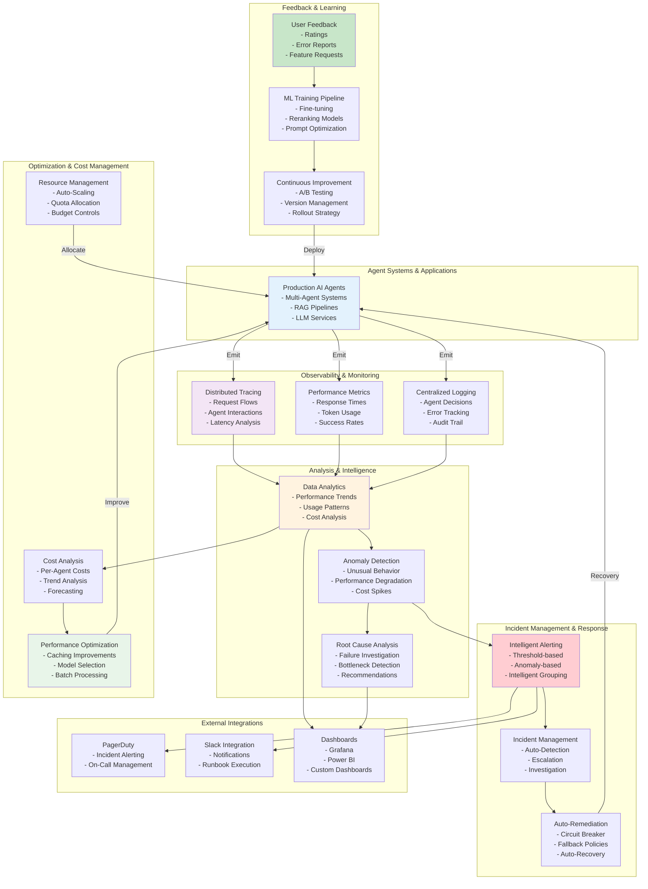

# Agentic AI Operations (AIOps) - Reference Architecture

## Overview
This diagram illustrates a comprehensive operational framework for managing, monitoring, and optimizing agentic AI systems in production, including observability, incident response, cost management, and continuous improvement.

## Architecture Diagram

## Key Components

| Component | Purpose | Technology |
|-----------|---------|-----------|  
| **Distributed Tracing** | Track requests across agent systems | Application Insights, Jaeger |  
| **Metrics Collection** | Gather performance indicators | Prometheus, StatsD |  
| **Log Aggregation** | Centralize and analyze logs | Application Insights, ELK |  
| **Anomaly Detection** | Identify unusual patterns | ML models, Statistical analysis |  
| **Intelligent Alerting** | Smart alert generation | APIM policies, Custom logic |  
| **Incident Management** | Track and resolve incidents | PagerDuty, Custom systems |  
| **Cost Management** | Monitor and optimize costs | Azure Cost Management |  
| **Continuous Learning** | Improve models over time | ML pipelines, Retraining |  

## Core Capabilities

### 1. Observability
- **Distributed Tracing**: Follow requests through multi-agent systems
- **Metrics**: Real-time performance indicators
- **Logging**: Comprehensive audit trail and debugging
- **Correlation**: Link events across systems

### 2. Monitoring
- **Real-time Dashboards**: Current system state
- **Historical Analysis**: Trends and patterns
- **Performance Baselines**: Compare against expectations
- **SLA Tracking**: Monitor service level agreements

### 3. Alerting & Incident Management
- **Threshold Alerts**: Static and dynamic thresholds
- **Anomaly Detection**: ML-based detection
- **Alert Grouping**: Reduce alert fatigue
- **Escalation**: Route to appropriate teams
- **On-Call Management**: Automatic page-out

### 4. Incident Response
- **Auto-Detection**: Discover problems automatically
- **Runbook Execution**: Automate response procedures
- **Remediation**: Self-healing capabilities
- **Documentation**: Incident records for learning

### 5. Cost Optimization
- **Usage Tracking**: Monitor token/API usage
- **Cost Attribution**: Allocate costs to projects
- **Forecasting**: Predict future costs
- **Optimization**: Recommend improvements

### 6. Continuous Improvement
- **A/B Testing**: Compare agent versions
- **Performance Tuning**: Optimize prompts and models
- **User Feedback**: Collect improvement ideas
- **Model Retraining**: Keep models current

## Operational Workflows

### Alert to Resolution
1. System emits metric violating threshold
2. Alert rule triggers
3. Intelligent grouping correlates alerts
4. Incident created and escalated
5. Teams notified via PagerDuty/Slack
6. On-call engineer investigates
7. Root cause analysis provides guidance
8. Remediation applied
9. Recovery verified
10. Post-mortem documentation

### Continuous Improvement Loop
1. Collect user feedback and ratings
2. Analyze performance metrics
3. Identify improvement opportunities
4. Fine-tune models or update prompts
5. Run A/B tests
6. Validate improvements
7. Roll out changes gradually
8. Monitor impact

## Best Practices

1. **Observability First**: Instrument everything for visibility
2. **Smart Alerting**: Focus on actionable alerts
3. **Automation**: Automate detection and response
4. **Runbooks**: Document procedures for common issues
5. **Postmortems**: Learn from failures
6. **Capacity Planning**: Plan for growth
7. **Cost Discipline**: Monitor and control spending
8. **Continuous Learning**: Regularly improve systems

## References

- [Azure Monitor & Application Insights](https://learn.microsoft.com/en-us/azure/azure-monitor/)
- [Observability Engineering](https://o11y.io/)
- [SRE Principles](https://sre.google/)
- [AIOps Best Practices](https://learn.microsoft.com/en-us/azure/architecture/ai-ml/)
