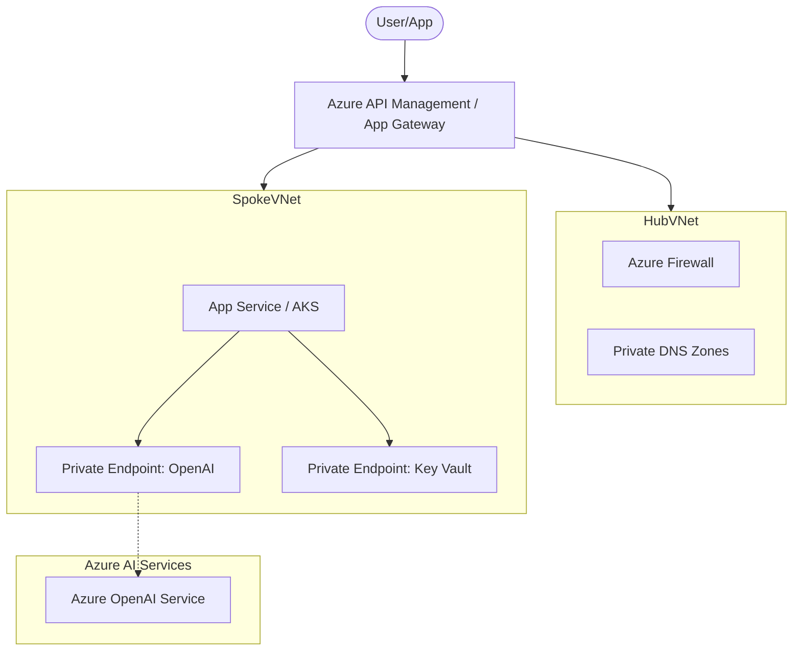

# Azure OpenAI Foundations Reference Architecture

This reference architecture illustrates the Enterprise Hub pattern for Azure OpenAI, focusing on central governance, security, and scalability.

## Architecture Diagram (Mermaid)

## Key Components
- **Azure API Management**: Provides throttling, caching, and token management.
- **Private Link / Endpoints**: Ensures all traffic stays within the Azure backbone.
- **Hub-Spoke Topology**: Separates shared network services from AI workloads.

## Reference Links
- [Azure OpenAI Landing Zone Accelerator](https://github.com/Azure/azure-openai-landing-zone)
- [Baseline OpenAI Architecture](https://learn.microsoft.com/en-us/azure/architecture/ai-ml/architecture/baseline-openai)
