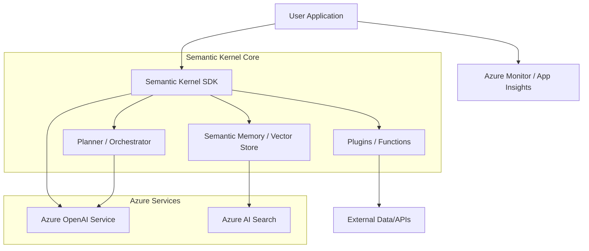

# Semantic Kernel Agent Reference Architecture

This reference architecture illustrates how to build intelligent agents using Semantic Kernel on Azure, leveraging planners, plugins, and memory.

## Architecture Diagram (Mermaid)

## Key Components

1.  **Semantic Kernel SDK**: The orchestration engine.
2.  **Plugins/Skills**: Encapsulated logic for specific tasks.
3.  **Planners**: Automatically create a plan to achieve user goals.
4.  **Vector Store**: Provides long-term memory for the agent.

## Implementation References

- [Semantic Kernel Documentation](https://learn.microsoft.com/en-us/semantic-kernel/)
- [Agentic AI Design Patterns](https://azure.microsoft.com/en-us/solutions/ai/)
