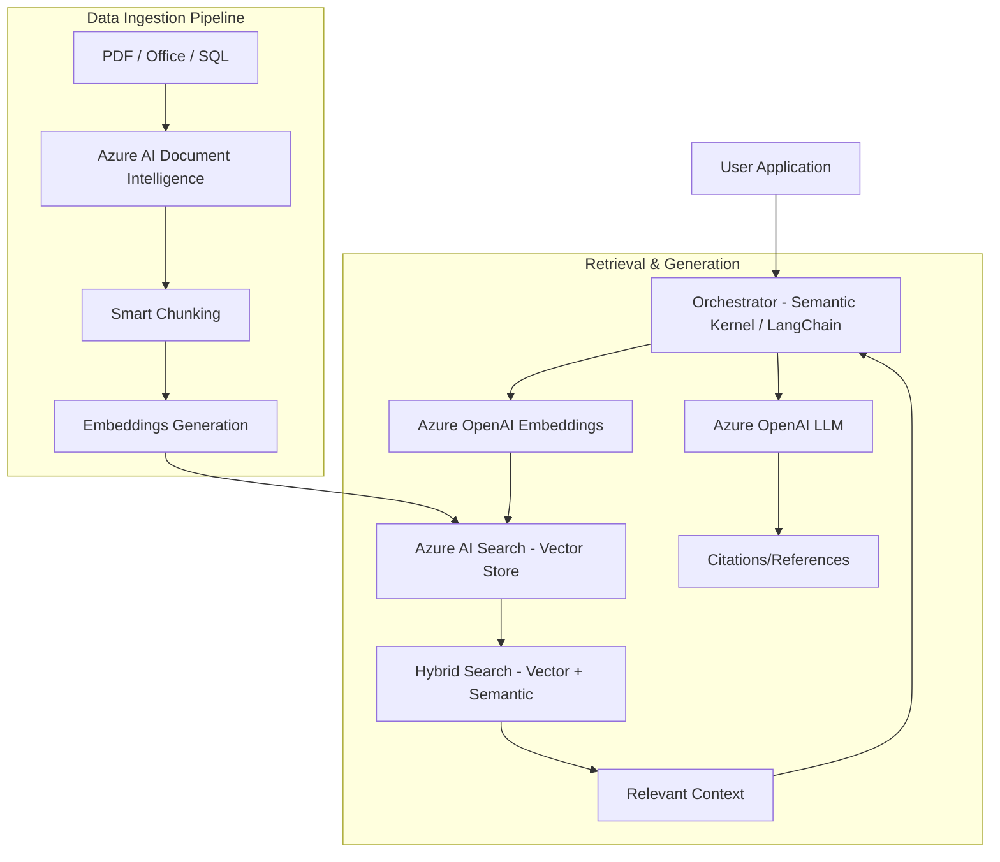

# Enterprise RAG Reference Architecture

This architecture demonstrates a production-grade Retrieval-Augmented Generation (RAG) pattern on Azure, incorporating advanced chunking, hybrid search, and citation management.

## Architecture Diagram (Mermaid)

## Key Components

1.  **Azure AI Search**: The core vector database for hybrid and semantic search.
2.  **Azure AI Document Intelligence**: Extracts structured data from documents.
3.  **Smart Chunking**: Strategy to ensure semantic context is preserved.
4.  **Hybrid Search**: Combines keyword search with vector search.

## Implementation References

- [Azure AI Search Documentation](https://learn.microsoft.com/en-us/azure/search/)
- [RAG with Azure OpenAI](https://learn.microsoft.com/en-us/azure/openai/concepts/use-your-data)
