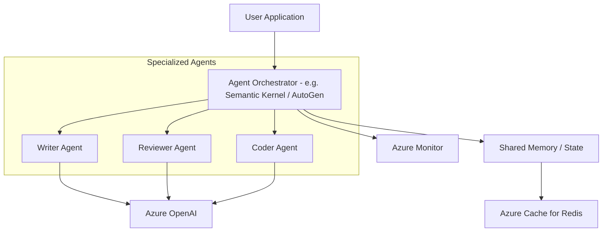

# Multi-Agent Orchestration Reference Architecture

This reference architecture illustrates a multi-agent system where a central orchestrator manages specialized agents to complete complex tasks.

## Architecture Diagram (Mermaid)

## Key Components

1.  **Agent Orchestrator**: Manages the conversation flow and task delegation between agents.
2.  **Specialized Agents**: LLM-powered entities with specific personas and toolsets (plugins).
3.  **Shared Memory**: A persistent state store (e.g., Redis) that allows agents to share context.
4.  **Azure OpenAI**: Provides the reasoning capabilities for all agents.

## Implementation References

- [AutoGen Documentation](https://microsoft.github.io/autogen/)
- [Semantic Kernel Agent Framework](https://learn.microsoft.com/en-us/semantic-kernel/frameworks/agent/)
