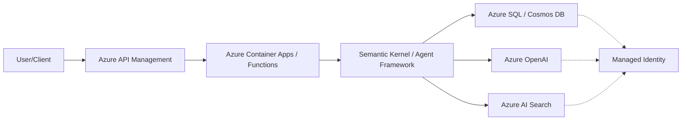

# Agent Enterprise Integration

This architecture demonstrates how to integrate AI agents into enterprise systems using Azure API Management, Managed Identities, and private networking.

## Architecture Diagram (Mermaid)

## Key Components
- **Azure API Management**: Governs and secures agent endpoints.
- **Managed Identities**: Eliminates the need for API keys in code.
- **Private Link**: Ensures data never traverses the public internet.
