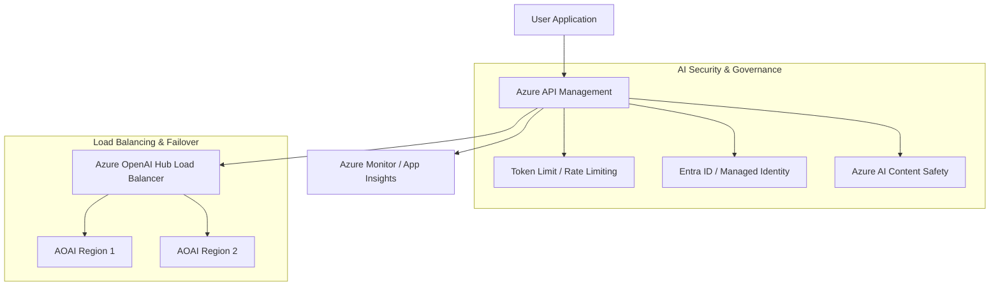

# Secure AI Gateway Reference Architecture

This architecture demonstrates how to implement a secure, governed gateway for Azure OpenAI services using Azure API Management (APIM).

## Architecture Diagram (Mermaid)

## Key Components

1.  **Azure API Management**: Acts as the single entry point for all AI requests, enforcing policies.
2.  **Azure AI Content Safety**: Detects and blocks harmful content in prompts and completions.
3.  **Managed Identity**: Ensures secure, passwordless authentication to Azure OpenAI.
4.  **Token-based Throttling**: Limits usage based on TPM (Tokens Per Minute) to prevent cost overruns.

## Implementation References

- [Azure API Management AI Gateway](https://learn.microsoft.com/en-us/azure/api-management/gen-ai-gateway-overview)
- [Secure Azure OpenAI](https://learn.microsoft.com/en-us/azure/architecture/guide/ai/openai-security)
