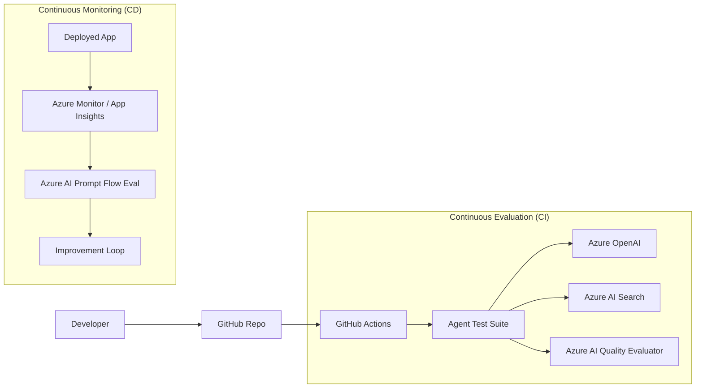

# Agentic AI Ops Reference Architecture

This architecture outlines the operational lifecycle for agentic AI systems, focusing on continuous evaluation, monitoring, and improvement.

## Architecture Diagram (Mermaid)

## Key Components

1.  **GitHub Actions**: Orchestrates the CI/CD pipeline for AI models and agent logic.
2.  **Azure AI Quality Evaluator**: Provides automated metrics (Groundedness, Relevance, etc.) for agent responses.
3.  **Azure AI Prompt Flow**: Used for both development and production monitoring of LLM flows.
4.  **Feedback Loop**: Results from monitoring are used to refine prompts, system instructions, and RAG parameters.

## Implementation References

- [Azure AI Studio Evaluation](https://learn.microsoft.com/en-us/azure/ai-studio/concepts/evaluation-approach-gen-ai)
- [Prompt Flow Documentation](https://learn.microsoft.com/en-us/azure/ai-studio/how-to/prompt-flow)
