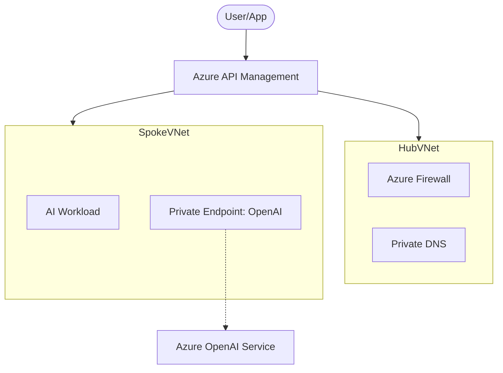
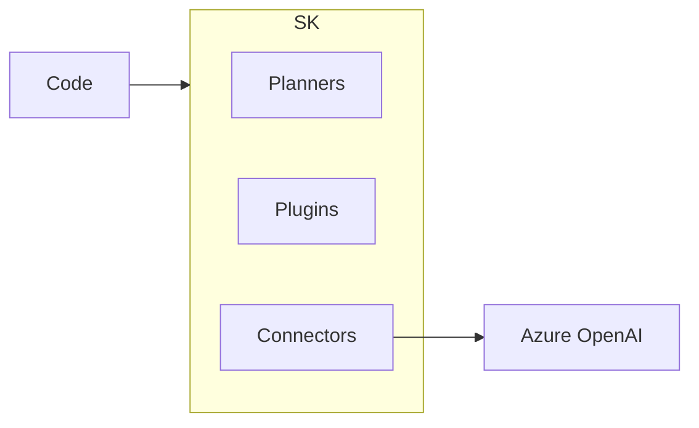
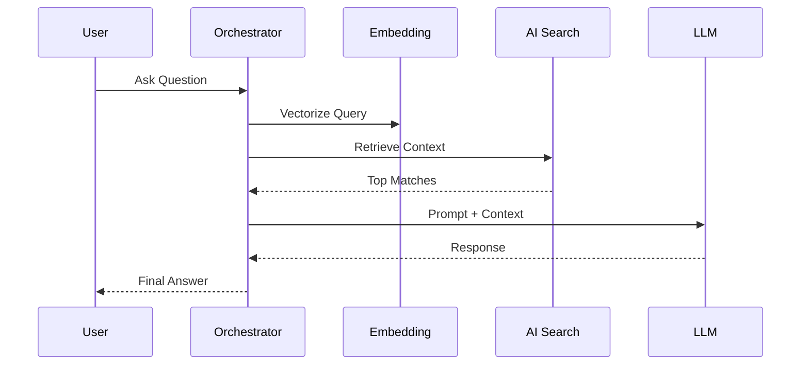

# Reference Architecture Diagrams

This directory contains reference architecture diagrams and design patterns for the concepts covered in this repository.

---

## 1. Azure OpenAI Foundations
*Enterprise Hub & Deployment Patterns*

### Architecture Diagram (Mermaid)

---

## 2. Semantic Kernel Agent
*SDK Architecture & Agent Framework*

### SDK Components

---

## 3. Enterprise RAG Assistant
*Retrieval-Augmented Generation (RAG) Architecture*

### RAG Flow

---

## 4. Multi-Agent Orchestration
*Agent Collaboration Patterns*

### Patterns
- **Concurrent**: Multiple agents work in parallel.
- **Sequential**: Step-by-step handoff between agents.
- **Group Chat**: Central manager orchestrates multiple specialized workers.

---

## 5. Secure AI Architecture
*Five-Layer Security Model*

### Security Layers
1. **Network Security**: VNet integration & Private Endpoints.
2. **Identity**: RBAC & Managed Identities (No API Keys).
3. **Content Safety**: Azure AI Content Safety filters.
4. **Data Protection**: Customer Managed Keys (CMK).
5. **Governance**: Azure Policy for AI.

---

## Reference Links
- [Azure Architecture Center](https://learn.microsoft.com/en-us/azure/architecture/)
- [Microsoft Learn: Semantic Kernel](https://learn.microsoft.com/en-us/semantic-kernel/)
